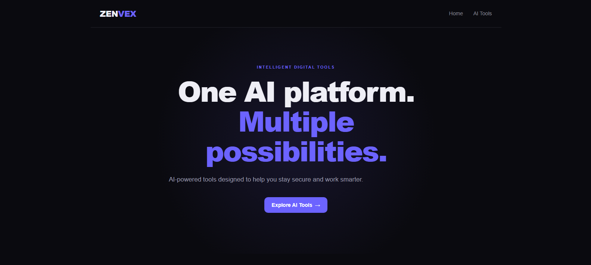
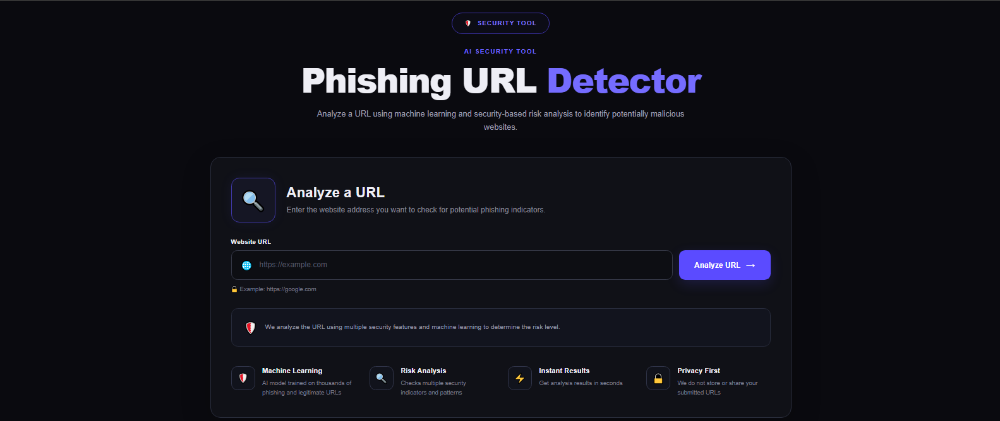
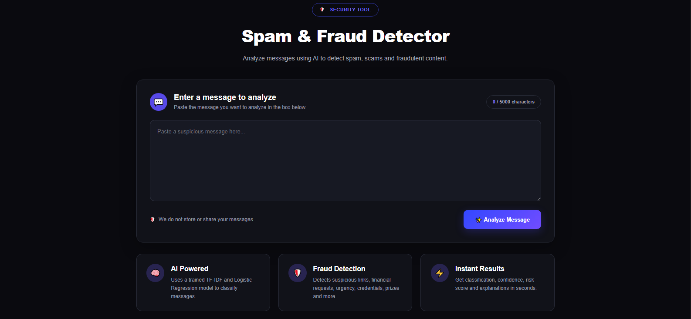
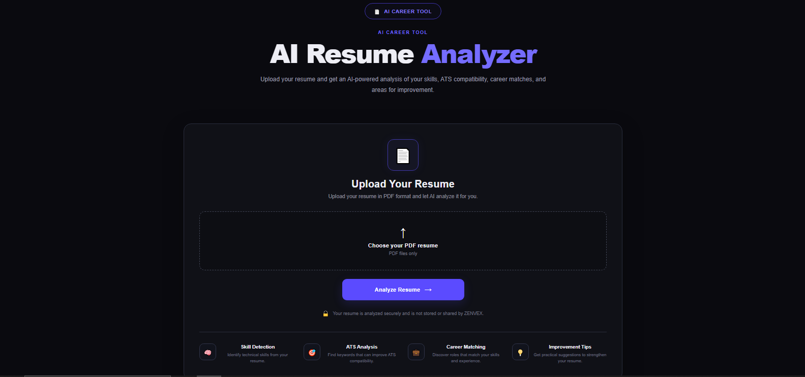
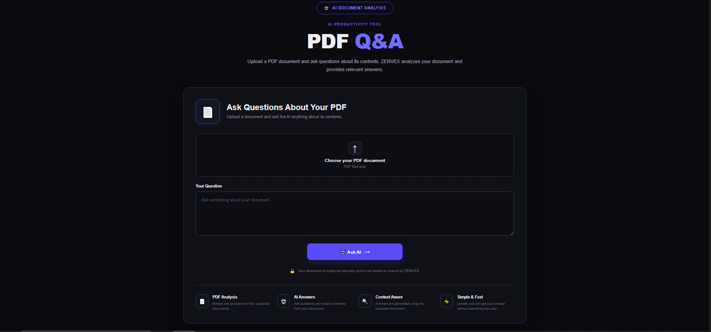

# ZenVex AI 

**ZenVex AI** is an AI-powered web platform that brings multiple intelligent security, career, and document-analysis tools together in one place.

The project is built with **Python, Flask, HTML, CSS, JavaScript, and Machine Learning**, with a focus on practical AI-powered tools that can be used through a simple web interface.

##  Features

###  Phishing URL Detector

Analyze URLs and identify potentially malicious or phishing websites using a trained machine-learning model.

**Features include:**

* URL classification
* Phishing risk detection
* Risk analysis
* URL feature extraction
* Machine-learning prediction

###  Spam & Fraud Message Detector

Analyze messages and determine whether they are potentially spam or legitimate.

**Features include:**

* Spam message classification
* Machine-learning prediction
* Simple message input interface
* Fast results

### AI Resume Analyzer

Upload a resume and analyze it using AI-powered document processing.

**Features include:**

* Resume PDF upload
* Resume content extraction
* Resume analysis
* Career-oriented feedback
* Structured results

### AI PDF Q&A

Upload a PDF document and ask questions about its contents.

**Features include:**

* PDF document upload
* Text extraction
* AI-powered question answering
* Context-based responses
* Interactive Q&A interface

---

## Technologies Used

### Backend

* Python
* Flask

### Machine Learning

* Scikit-learn
* Random Forest Classifier
* Feature extraction
* Machine-learning based classification

### Frontend

* HTML5
* CSS3
* JavaScript
* Jinja2 Templates

### Document Processing

* PDF text extraction
* Resume parsing
* AI-based document analysis

### Development Tools

* Visual Studio Code
* Git
* GitHub
* Python Virtual Environment

---

## 📂 Project Structure

```text
ZenVex-AI/
│
├── app.py
├── requirements.txt
├── README.md
├── .gitignore
│
├── src/
│   ├── feature_extraction.py
│   ├── inspect_dataset.py
│   ├── pdf_qa.py
│   ├── predict.py
│   ├── resume_analyzer.py
│   ├── resume_pdf.py
│   ├── risk_analysis.py
│   ├── spam_predict.py
│   ├── train_model.py
│   └── train_spam_model.py
│
├── static/
│   ├── css/
│   │   └── style.css
│   └── js/
│       └── main.js
│
└── templates/
    ├── base.html
    ├── error.html
    ├── index.html
    ├── pdf_qa.html
    ├── phishing.html
    ├── resume.html
    └── spam.html
```

> **Note:** Datasets and trained model files are excluded from this repository through `.gitignore`.

---

## ⚙️ Installation

### 1. Clone the repository

```bash
git clone https://github.com/Sulayman2205/ZenVex-AI.git
```

### 2. Navigate to the project

```bash
cd ZenVex-AI
```

### 3. Create a virtual environment

Windows:

```powershell
python -m venv venv
```

### 4. Activate the virtual environment

PowerShell:

```powershell
venv\Scripts\Activate.ps1
```

If PowerShell blocks activation, you can use:

```powershell
venv\Scripts\activate.bat
```

### 5. Install dependencies

```bash
pip install -r requirements.txt
```

---

## Running the Application

Start the Flask application:

```bash
python app.py
```

The application will normally be available at:

```text
http://127.0.0.1:5000
```

Open the address in your browser to access ZenVex AI.

---

## Phishing Detection

The phishing detector uses URL-based features to classify websites.

Example features include:

* URL length
* Domain length
* HTTPS usage
* Special characters
* Domain characteristics
* URL structure
* Other extracted URL features

The extracted features are passed to a trained machine-learning classifier to produce a prediction and risk assessment.

---

## Machine Learning

The phishing detection component was trained using the **PhiUSIIL Phishing URL Dataset**.

The project uses a **Random Forest Classifier** for phishing URL classification.

The spam detection component uses a separate machine-learning model trained for message classification.

Training scripts are included in the `src/` directory.

---

## Project Goals

ZenVex AI was created to explore how AI and machine learning can be integrated into practical web applications.

The main goals are:

* Build useful AI-powered tools
* Apply machine learning to real-world security problems
* Create an easy-to-use web interface
* Combine multiple AI utilities into one platform
* Gain practical experience with Python, Flask, ML, and web development

---

## 📸 Screenshots

### 🏠 ZenVex AI Dashboard



### 🔗 Phishing URL Detector



### 📱 Spam & Fraud Detector



### 📄 AI Resume Analyzer



### 🤖 AI PDF Q&A



## Future Improvements

Planned improvements include:

* Improved phishing detection accuracy
* More advanced URL analysis
* Better spam and fraud detection
* More detailed resume scoring
* Improved PDF question answering
* User accounts and authentication
* Database integration
* API endpoints
* Cloud deployment
* Improved UI/UX
* More AI-powered tools

---

## Developer

**Muhammad Suleman**

BS Computer Science Student
NUML University, Islamabad

Interested in:

* Artificial Intelligence
* Machine Learning
* Web Development
* Cybersecurity
* Software Development

---

## Support

If you find this project interesting, consider giving the repository a ⭐ on GitHub.

**GitHub:**
https://github.com/Sulayman2205/ZenVex-AI
